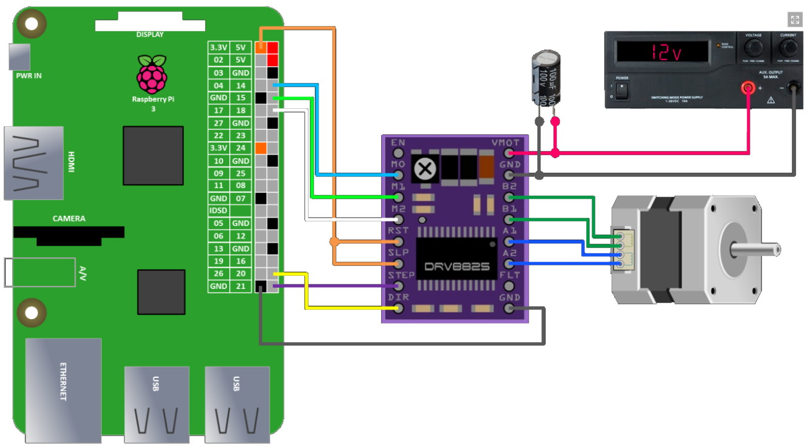
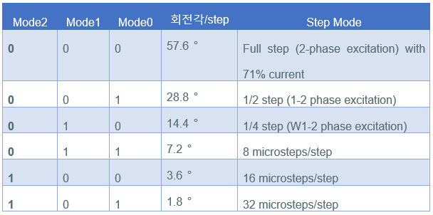
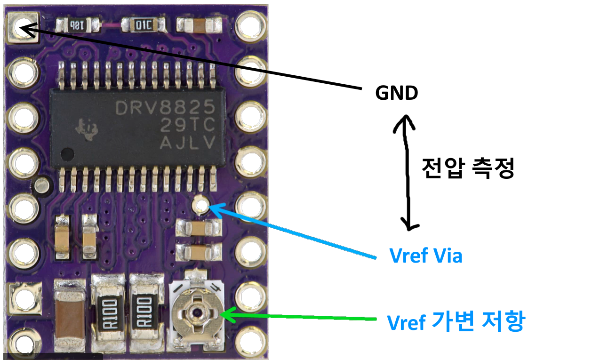
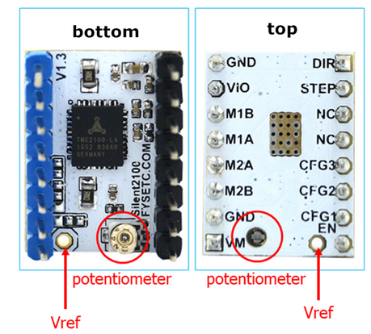
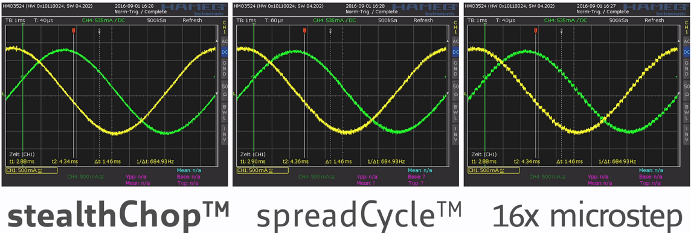
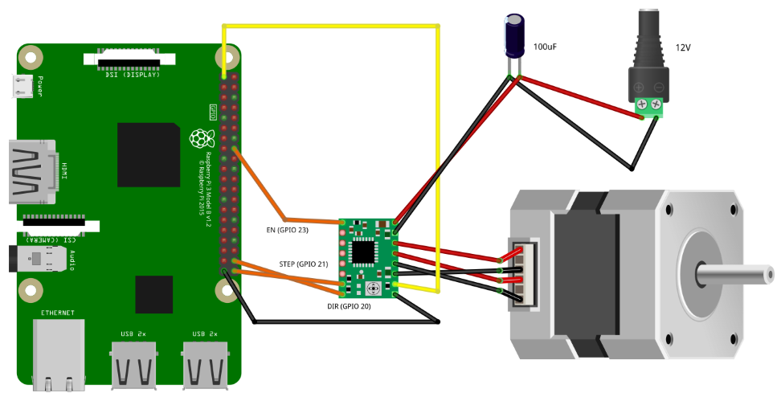

# 양극 스테퍼모터(Nema 시리즈)
책에서는 입문용으로 단극 스테퍼모터만 다루었는데 이번에는 양극 스테퍼 모터를 알아보도록 하겠다. 3D 프린터, CNC 머신 등 정밀한 제어를 필요로 하는 곳에는 NEMA 규격의 양극 스테퍼 모터를 많이 사용한다.<br/>
미국의 미국 전기공업회 NEMA(National Electrical Manufactures Association)의 NEMA ICS 16-2001 스테퍼 모터 규격을 준수한 모터를 NEMA 표준 모터라 부른다. NEMA 11, NEMA 14, ... NEMA 34와 같이 이름을 사용하는데 뒷 부분의 숫자는 사이즈를 말한다. NEMA 11은 1.1인치 하우징 크기 모터를 말한다. 따라서 숫자가 클수록 모터의 크기 및 토크가 커진다고 보면 된다. 3D 프린터에서는 주로 17, 23을 많이 사용한다.<br/><br/>
 <br/><br/>


## 양극 스테퍼 모터의 작동 원리
https://en.nanotec.com/support/knowledge-base-pages/stepper-motors-animation/?tx_nanotec_animation%5Binitial%5D=motor_4lead&cHash=101d605e2a66cd40d55f422d77b3a0b6 사이트는 스테퍼 모터의 작동 원리를 잘 설명하고 있다. 위 페이지를 방문하면 아래 그림처럼 직접 모터 종류를 지정하고 테스트를 해볼 수 있다. 그림 아래 부분의 Half step, Full Step 버튼을 누르면 한 스텝씩 모터가 회전하며 Continous를 조절하면 자동으로 회전하는 모터를 확인할 수 있다.<br/> 


<br /><br />

### Full step, Half step, Micro step
모터에 전류를 공급하는 방식에 따른 분류이며 이 방식에 따라 토크 크기, 1step 당 회전 각이 달라진다. 책에서 단극 스테퍼모터를 설명하면서 간단하게  Full step, Half step을 언급했기 때문에 여기에서는 설명을 생략한다. 양극 스테퍼 모터의 경우 Full step 모드에서 1.8° /step, Half step은 1.8°/2step, Micro step에서는 1/4, 1/8, 1/16, ...으로 변할 수록 1.8° 회전에 필요한 step 수가 2배씩 늘어난다. 
Full step을 기준으로 회전각을 1/2, 1/4, 1/8 ... 로 나누어 미세하게 회전하게 하는 것이 Micro step이다. 실제 Full step으로 회전하면 모터에서 심한 소음 및 진동이 발생한다. 하지만 Micro step을 이용하면 회전각이 줄어들 수록 소음 및 진동이 줄어든다. 대신 Full step의 회전 속도를 유지하려면 단위 시간당 step 수를 2, 4, 8, ... 배로 늘려줘야 한다. 유튜브 https://www.youtube.com/watch?v=Bs1zIZV1uSY, https://www.youtube.com/watch?v=tRoT3qpndbU 에서 Micro step에 관한 훌륭한 동영상을 소개하고 있다.<br /><br />


# 양극 스테퍼 모터 드라이버
적층식 3D 프린터 제어부를 유심히 살펴보면 스테퍼 모터를 제어하는 드라이버 칩을 확인할 수 있다. A4988, DRV8825가 많이 사용된다. TMC2XXX는 스테퍼 모터 구동시 발생하는 소음을 줄인 독일 Trinamic사의 제품이며 앞의 두 제품보다 가격이 비싸다. 하지만 스테퍼 모터의 소음 감소에 뛰어난 성능을 내기 때문에 앞으로 많은 사용이 예상된다. TMC 시리즈는 SPI, UART 통신을 지원하는 TMC2130, TMC2208 버젼도 있다.<br/>


좌측은 Allegro사의 A4988모터 드라이버 IC를 이용한 A4988 모듈이며 가운데는 TI사의 DRV8825 IC를 이용한 모듈이다. 두 제품 모두 Pololu사의 제품이다. 마지막 우측은 TMC2100이며 큰 방열판을 사용한다. 제품의 크기와 사용법이 아주 유사하다. http://reprap.org/wiki/A4988_vs_DRV8825_Chinese_Stepper_Driver_Boards 사이트에  A4988, DRV8825 두 제품을 비교한 자료가 있으며 http://reprap.org/wiki/TMC2100 에는 TMC2100에 대한 설명이 있다.<br/><br/>


# DRV8825와 NEMA 17 그리고 파이의 연결
DRV8825와 관련한 내용은 https://www.rototron.info/raspberry-pi-stepper-motor-tutorial/ 에서 많은 부분을 참조했음을 미리 밝혀둔다.<br/><br/>

## DRV8825 스테퍼 모터 드라이버
DRV8825는 다음과 같은 특징이 있다.<br />
* Full step ~ 1/32까지 6단계 조절 가능<br />
* 3.3V레귤레이터 내장(파이와 연결 쉬움)<br />
* Vref를 이용해 허용 전류 제한 가능 Imax = 2 X Vref<br /><br />

## 연결
파이와 DRV8825 그리고 NEMA 스테퍼 모터는 다음과 같이 연결한다.

먼저 파이와 DRV8825는 다음과 같이 연결한다.<br/>
* STEP핀을 파이의 임의의 GPIO 핀에 연결한다. 여기에서는 21번에 연결<br />
* 회전 방향을 정하는 DIR핀을 파이의 임의의 GPIO 핀에 연결한다. 여기에서는 20번에 연결<br />
* RST(Reset), SLP(Sleep)는 3.3V에 연결해 항상 High 상태를 유지한다. Low 값이면 Reset, Sleep 모드가 된다.<br />
* M0, M1, M2는 GPIO 14, GPIO 15 그리고 GPIO 18에 연결한다.(역시 다른 핀 연결 가능) 이 3개의 핀은 Full, Half, Micro 등의 스텝 방식을 결정한다. <br /><br />

M0, M1, M2 값에 따른 모터 회전 방식 및 회전각은 다음과 같다.
<br/><br/>

NEMA 17과 DRV8825는 다음과 같이 연결한다.
* Vmot, GND는 모터에 공급할 외부 DC 전원을 연결한다. 8.2V ~ 45V 까지 연결 가능하다. 하지만 최대 2.5A의 공급 전류를 초과하면 안된다. 그리고 100uF의 커패시터를 연결해 스파크 발생을 방지한다. 스파크 방지용 커패시터는 책의 DC모터를 참조한다.<br />
* A1, A2, B1, B2는 양극 스테퍼 모터의 4개 선을 연결한다. 양극 모터는 내부 2개의 코일에서 한 쌍씩 모두 4개의 선이 제공된다. 반드시 쌍을 맞추어 연결한다. 만약 모터 데이터 시트에서 확인이 어려우면 모터를 손으로 돌려 발전을 한 다음 4개 선 중 2개를 선택해 전압을 측정한다. 전압이 측정되는 2개의 선이 한 쌍이 된다.
* GND는 파이의 GND와 공유해서 전위차를 맞춘다. 

## 모터 공급 전류 제한
DRV8825의 가변 저항을 조절하면 모터에 공급되는 최대 전류를 제한할 수 있다. 가변 저항을 조절해 X 2의 값이 최대 공급 전류가 된다.<br/><br/>
_I_max= V_ref  ×2_<br/>


<br/><br/>
위 그림에서 가변 저항과 GND의 전위차를 측정하면 된다. 가변 저항이 금속 재질이기 때문에 가변저항에 멀티미터 프로브를 접촉해도 된다.

> 항상 모터를 연결하기 전에 데이터 시트를 참조해 모터에 공급 가능한 전류를 체크한 다음 공급 전류를 미리 제한하도록 한다


<br/><br/>
## drv8825를 이용한 NEMA 스테퍼 모터 제어 프로그래밍
이제 파이에서 양극 NEMA 스테퍼 모터를 제어하는 프로그래밍을 해본다. <br/><br/>

```python
#!/usr/bin/env python
#-*- coding: utf-8 -*-
#If this code works, it was written by Seunghyun Lee(www.bluebaynetworks.co.kr).
#If not, I don't know who wrote it
from time import sleep
import RPi.GPIO as GPIO

DIR = 20   # Direction GPIO Pin
STEP = 21  # Step GPIO Pin
CW = 1     # Clockwise Rotation
CCW = 0    # Counterclockwise Rotation
SPR = 200   # Steps per Revolution (360 / 7.5)
MODE = (14, 15, 18)   # Microstep Resolution GPIO Pins
resolution = 'Full'
delay = 0.0
rotate_dir = CW
RES = {'Full': (0, 0, 0),
              'Half': (1, 0, 0),
              '1/4': (0, 1, 0),
              '1/8': (1, 1, 0),
              '1/16': (0, 0, 1),
              '1/32': (1, 0, 1)}

def set_step_mode(step_mode):
    global resolution, SPR

    if(step_mode == 'Full'):#1.8/step -->200 step / rotation
        SPR = 200
    elif(step_mode == 'Half'):
        SPR = 200 * 2
    elif(step_mode == '1/4'):
        SPR = 200 * 4
    elif(step_mode == '1/8'):
        SPR = 200 * 8
    elif(step_mode == '1/16'):
        SPR = 200 * 16
    elif(step_mode == '1/32'): 
        SPR = 200 * 32
    else:    
        print "Unknown step mode" 
        return

    print "set_step_mode:", step_mode, "  SPR:", SPR 
    resolution = step_mode
    for i in range(3):
        GPIO.setup(MODE[i], GPIO.OUT)
        GPIO.output(MODE[i], RES[step_mode][i])

    return


def set_dir(direction):
    if(direction == 'CW'):
        print "direction Clockwise" 
        rotate_dir = CW
    else:    
        print "direction Counter Clockwise" 
        rotate_dir = CCW
    GPIO.output(DIR, rotate_dir)
        
def rotate(angle):
    step_count = int(SPR * angle  / 360.0)
    
    print "angle:", angle, "  step count:", step_count, "  delay:", delay 
    for x in range(step_count):
        GPIO.output(STEP, GPIO.HIGH)
        sleep(delay)
        GPIO.output(STEP, GPIO.LOW)
        sleep(delay)
    return    

GPIO.setmode(GPIO.BCM)
GPIO.setup(DIR, GPIO.OUT)
GPIO.setup(STEP, GPIO.OUT)

set_step_mode('1/8')
delay = 60.0 / (SPR * 120)

set_dir('CW')
rotate(3600)
sleep(1)

set_dir('CCW')
rotate(720)

GPIO.cleanup()

```

# TMC2100과 NEMA 17 그리고 파이의 연결
## TMC2100 스테퍼 모터 드라이버
TMC2100은 다음과 같은 특징이 있다.<br/>
* 4.75 ~ 46V DC까지 모터 전원 공급<br/>
* 2A 전류 (피크 2.5A)까지 공급 가능<br/>
* 256 마이크로 스텝 제공<br/>
* stealthChop™ 모드 : 최저 소음과 부드러운 모터 회전 제공.<br/>
* spreadCycle™ 모드 : 적은 소음과 비교적 강한 토크 제공.<br/>
* 3.3V레귤레이터 내장(파이와 연결 쉬움)한 제품 제공<br/>
* Vref를 이용해 허용 전류 제한 가능<br/>
* 모터 정지 파악 후 3 ~ 4초 이내에 모터 소모전류를 34% 수준으로 감소시킴<br/>
* 과열시(150도) 자동으로 작동 중지<br/><br/>

TMC2100은 DRV8825, A4988과 달리 모듈 하단에 가변 저항이 달려있다. 아마도 발열 문제로 인한 큰 방열판을 고려한 배치인 것 같다.<br/>
<br/><br/>

스텝 방식을 결정하는 핀 구성은 다음과 같다.
> _모듈 구성에 따라 핀 구성이 다를 수 있기 때문에 제품 데이터 시트를 최우선으로 참조한다._
<br/><br/>
위 그림은 필자가 구매한 watterott사 제품의 중국 복제품의 핀 구성이다. 좌측 그림의 주황, 녹색, 노란색은 점퍼 세팅이다. 오른쪽 데이터 시트의 표를 참조해 점퍼를 납땜한다. 
노란색, 녹색 점퍼의 가운데 위치한 CFG1, CFG2를 양 옆의 GND 또는 ViO와 연결시키거나 그대로 두는 방식(Open)으로 납땜하면 된다. <br/>
> _스텝 방식에 따라 미리 점퍼를 납땜해야 하기 때문에 스텝모드 변경이 어려운 단점이 있다._

Chopper Mode의 spreadCycle, stealthChop  두가지 모드에 대한 설명은 유튜브 https://www.youtube.com/watch?v=Q0sJlGh9WNY 에 자세히 나와있다. DRV8825, A4988의 16 마이크로스텝보다 TMC2100이 훨씬 전류 공급 곡선이 깨끗하다. stelathChop이 가장 깨끗한 파형을 제공하며 소음도 가장 적다.

<br/><br/>

## 연결
TMC2100의 경우 점퍼를 세팅하지 않고 초기 상태로 사용하면 stealthChop 모드의 16스텝이 된다. 이 모드에서 작업을 해보겠다. 참고로 제조사는 1/16 stealthChop 모드를 가장 추천한다.
> _TMC2100은 3~5V 로직 전압, 5V 로직 전압 2가지가 존재한다. 3.5V제품은 내부에 Voltage Regulator가 있다. 3~5V 제품을 사용해야 파이와 연결하기 쉽다. 참고로 5V 전용 제품은 로직 전압 핀 ViO 위치에 5V로 표기되어 있다. _

파이와 TMC2100 그리고 NEMA 스테퍼 모터는 다음과 같이 연결한다.
먼저 파이와 TMC2100는 다음과 같이 연결한다.<br/>
* STEP핀을 파이의 임의의 GPIO 핀에 연결한다. 여기에서는 21번에 연결<br />
* 회전 방향을 정하는 DIR핀을 파이의 임의의 GPIO 핀에 연결한다. 여기에서는 20번에 연결<br />
* EN(Enable)핀은 GPIO 23번에 연결한다. EN핀은 초기 비활성 상태(HIGH)로 유지하면서 DIR핀을 세팅한다. 그리고 다시 활성 상태(LOW)로 바꾼다음 STEP핀을 ON, OFF시키면 모터가 회전한다.<br />
* 점퍼를 통해 스텝 모드를 미리 정했기 때문에 CFG1, CFG2, CFG3은 연결할 필요 없다. <br /><br />

<br/><br/>


## 모터 공급 전류 제한
TMC2100의 가변 저항을 조절하면 모터에 공급되는 최대 전류를 제한할 수 있다. 가변 저항을 조절해 X 2의 값이 최대 공급 전류가 된다. 가변 저항 측정방법은 DRV8825와 동일하다.<br/><br/>
_I_rms= V_ref  × 1.77A / 2.5V = V_ref X 0.71_ <br/>
_I_max= I_rms X 1.41_<br/>


<br/><br/>
## NEMA 스테퍼 모터 제어 프로그래밍
파이에서 양극 NEMA 스테퍼 모터를 제어하는 프로그래밍을 해본다. 
TMC2100 모듈을 판매하는 watterott사의 github 사이트(https://github.com/watterott/SilentStepStick/tree/master/software)에 TMC2100을 제어하는 아두이노 소스코드가 있다. 작동 원리는 파이 역시 차이가 없기 때문에 이 코드들을 참조하면 유용하게 사용할 수 있다.
<br/><br/>

## tmc2100를 이용한 NEMA 스테퍼 모터 제어 프로그래밍
tmc2100은 drv8825와는 달리 step mode를 납땝을 이용해 미리 정한 상태에서 작동한다. 따라서 파이썬 코드에서 스텝 모드 설정이 불가능하다. 나머지 코드는 drv8825와 동일하다.<br/><br/>

```python
#!/usr/bin/env python
#-*- coding: utf-8 -*-
#If this code works, it was written by Seunghyun Lee(www.bluebaynetworks.co.kr).
#If not, I don't know who wrote it
from time import sleep
import RPi.GPIO as GPIO

EN = 18    # Low:Enable
DIR = 20   # Direction GPIO Pin
STEP = 21  # Step GPIO Pin
CW = 1     # Clockwise Rotation
CCW = 0    # Counterclockwise Rotation
SPR = 200   # Steps per Revolution (360 / 7.5)

resolution = 'Full'
delay = 0.0
rotate_dir = CW


def set_dir(direction):
    if(direction == 'CW'):
        print "direction Clockwise" 
        rotate_dir = CW
    else:    
        print "direction Counter Clockwise" 
        rotate_dir = CCW
    GPIO.output(DIR, rotate_dir)
        
def rotate(angle):
    step_count = int(SPR * angle  / 360.0)
    
    print "angle:", angle, "  step count:", step_count, "  delay:", delay 
    for x in range(step_count):
        GPIO.output(STEP, GPIO.HIGH)
        sleep(delay)
        GPIO.output(STEP, GPIO.LOW)
        sleep(delay)
    return    

GPIO.setmode(GPIO.BCM)
GPIO.setup(EN, GPIO.OUT)
GPIO.setup(DIR, GPIO.OUT)
GPIO.setup(STEP, GPIO.OUT)
GPIO.output(EN, GPIO.LOW)

SPR = SPR *16 #StealthChop(16 step)
delay = 60.0 / (SPR * 120)      

set_dir('CW')
rotate(3600)
sleep(1)

set_dir('CCW')
rotate(720)

GPIO.cleanup()

```
